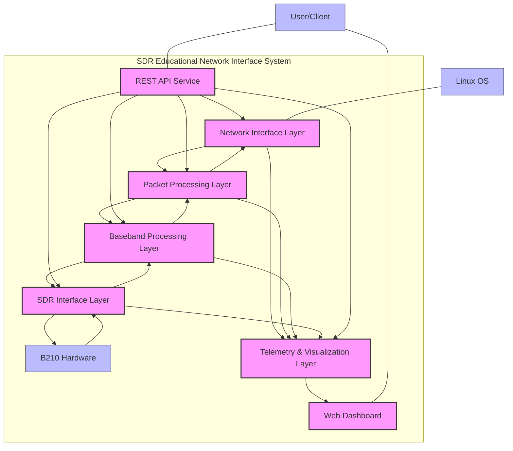
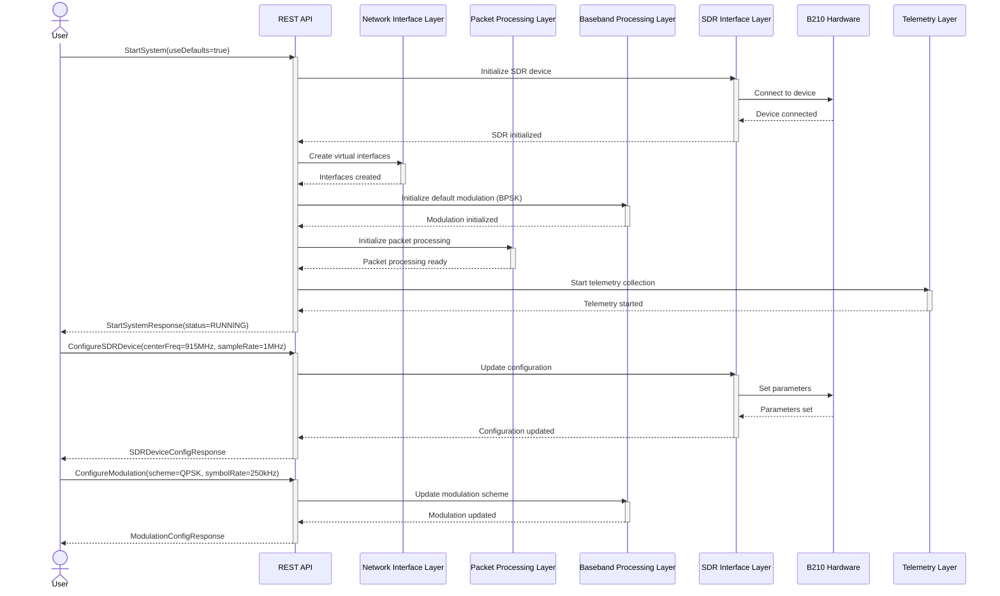
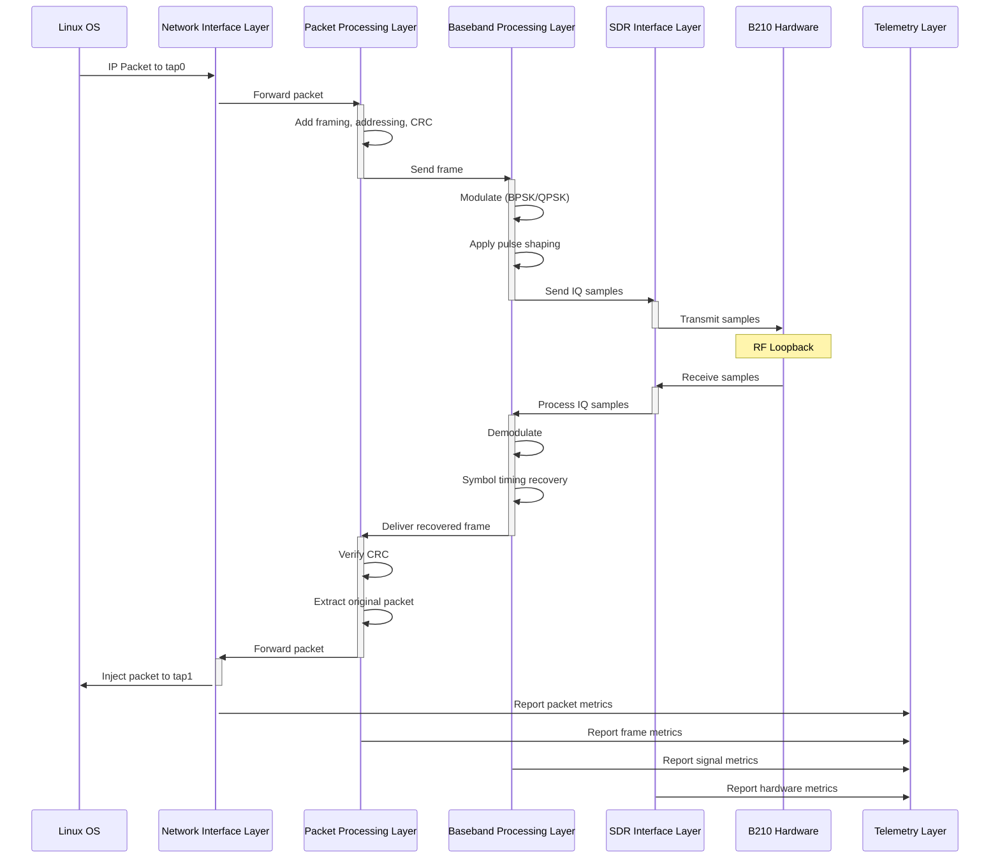
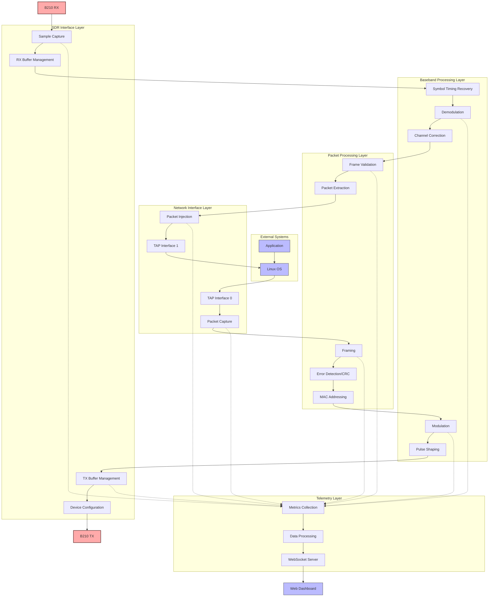
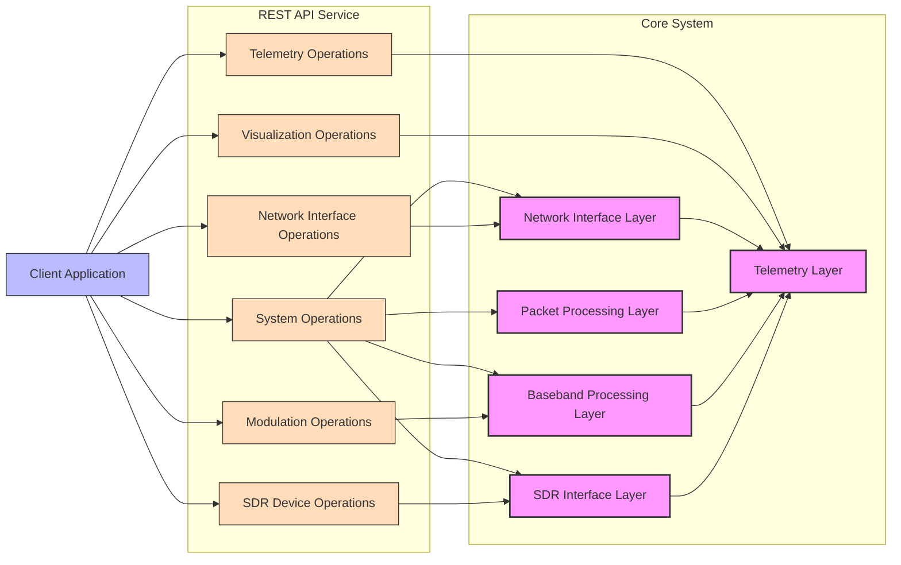

# Project Requirements
> My project has educational purposes and the target audience are developers in the wireless connectivity domain.
I have a Software Defined Radio device of brand and model Ettus UHD B210. My idea is to use this device via uhd driver and write an application for linux that creates a communication channel that loops back through the B210 device and back into the linux machine in a 2-way channel. The application should open 2 network devices in the linux environment, which can be used to send and receive IP traffic from and to each other.
For the code that controls the traffic over the B210 device, I'd like to implement a very simple modulation scheme, and channel access mechanisms such that the entire code and system is easy to understand and play with. Moreover, I want to build robust telemetry and debugging tools that will help the user visualize the entire communication chain, helping the understanding and development process.

# Project Design Document

## Initial Analysis and Brainstorming

# Low-Level Design Document: B210 SDR IP Loopback Communication Channel

## Executive Summary

This document outlines a design for implementing a software-defined radio (SDR) loopback communication channel using the Ettus UHD B210 device. The system will create two virtual network interfaces in Linux that communicate with each other through the B210 SDR hardware, implementing simple modulation schemes and channel access mechanisms. The design prioritizes educational value, simplicity, reliability, and observability through comprehensive telemetry and visualization tools.

## Core Critical High-Impact Decisions

### 1. Network Interface Implementation Approach

**Options:**

A. **TUN/TAP Interfaces**
   - Pros:
     - Direct kernel integration for IP packet handling
     - Standard approach for virtual networking devices
     - Efficient performance with minimal overhead
   - Cons:
     - Requires root privileges
     - More complex implementation
     - Less portable across Linux distributions

B. **User-space Network Stack**
   - Pros:
     - No root privileges required
     - More portable
     - Complete control over network stack
   - Cons:
     - Higher overhead
     - More complex to implement correctly
     - Potentially lower performance

**Decision:** Implement using TUN/TAP interfaces (Option A) for better performance and standard Linux integration. This approach aligns better with educational goals as it uses standard Linux networking concepts.

### 2. SDR Processing Architecture

**Options:**

A. **Threaded Architecture**
   - Pros:
     - Simpler implementation
     - Lower latency for small data volumes
     - Easier to reason about for educational purposes
   - Cons:
     - Limited scalability
     - Potential for thread synchronization issues
     - Less efficient for high throughput

B. **Asynchronous Event-driven Architecture**
   - Pros:
     - Better scalability
     - More efficient resource utilization
     - Modern approach to I/O handling
   - Cons:
     - More complex implementation
     - Steeper learning curve
     - Potentially harder to debug

**Decision:** Use a Threaded Architecture (Option A) for simplicity and educational clarity. The application's primary purpose is educational, and a threaded model will be easier to understand and explain.

### 3. Modulation Scheme Implementation

**Options:**

A. **Custom Implementation from Scratch**
   - Pros:
     - Complete control over implementation
     - Maximum educational value
     - Can be optimized for simplicity
   - Cons:
     - Time-consuming development
     - Potential for bugs in core communication logic
     - Requires deep signal processing knowledge

B. **Leverage GNU Radio Blocks**
   - Pros:
     - Proven, tested implementations
     - Faster development
     - Industry-standard approach
   - Cons:
     - Additional dependency
     - Less educational value if treated as black boxes
     - Potential overhead from GNU Radio framework

**Decision:** Implement a hybrid approach - use simple custom modulation implementations for educational clarity but leverage GNU Radio for complex signal processing where appropriate. This provides educational value while ensuring reliability.

### 4. Telemetry and Visualization Approach

**Options:**

A. **Web-based Dashboard**
   - Pros:
     - Modern, interactive UI
     - Accessible from any browser
     - Separation of concerns between backend and frontend
   - Cons:
     - Additional complexity with web server
     - Requires web development skills
     - Potential performance overhead

B. **Native Application with GUI**
   - Pros:
     - Better performance
     - Tighter integration with SDR code
     - No need for web server
   - Cons:
     - Less portable
     - More complex deployment
     - UI framework dependencies

C. **Command-line Tools with Data Export**
   - Pros:
     - Simplest implementation
     - Lowest overhead
     - Most flexible for integration with other tools
   - Cons:
     - Less intuitive for visualization
     - Requires external tools for graphing
     - Less appealing for educational purposes

**Decision:** Implement Option A (Web-based Dashboard) using lightweight frameworks. This provides the most accessible and modern interface for educational purposes while allowing separation of concerns.

## System Architecture

### High-Level Components

1. **SDR Interface Layer**
   - Manages communication with the B210 device via UHD driver
   - Implements TX and RX signal chains
   - Handles hardware configuration and tuning

2. **Modulation/Demodulation Layer**
   - Implements simple modulation schemes (BPSK, QPSK, etc.)
   - Handles framing and synchronization
   - Implements channel coding and error correction

3. **Network Interface Layer**
   - Creates and manages TUN/TAP interfaces
   - Handles IP packet encapsulation/decapsulation
   - Implements addressing and routing between interfaces

4. **Channel Access Layer**
   - Implements basic MAC protocols (CSMA, TDMA, etc.)
   - Manages transmission timing and collision avoidance
   - Handles retransmissions and acknowledgments

5. **Telemetry and Visualization Layer**
   - Collects performance metrics and signal data
   - Provides real-time visualization of signals and packets
   - Offers debugging tools and packet inspection

### Data Flow

1. IP packets enter through TUN/TAP interface A
2. Packets are encapsulated with headers and prepared for transmission
3. Digital modulation is applied to convert bits to complex baseband signals
4. SDR transmits signals through TX chain of B210
5. Signals are received through RX chain of B210
6. Demodulation recovers original bits from received signals
7. Packets are extracted and validated
8. Valid packets are forwarded to TUN/TAP interface B
9. Throughout this process, telemetry data is collected and sent to visualization layer

## Detailed Component Design

### 1. SDR Interface Layer

```java
public class SDRDevice {
    private UHDDevice device;
    private StreamArgs txStreamArgs;
    private StreamArgs rxStreamArgs;
    
    public void initialize(String args) {
        // Initialize UHD device with appropriate parameters
    }
    
    public void configureTx(double freq, double rate, double gain) {
        // Configure transmitter chain
    }
    
    public void configureRx(double freq, double rate, double gain) {
        // Configure receiver chain
    }
    
    public void transmit(ComplexBuffer samples) {
        // Send samples to device
    }
    
    public ComplexBuffer receive(int numSamples) {
        // Receive samples from device
    }
}
```

### 2. Modulation/Demodulation Layer

```java
public interface Modulator {
    ComplexBuffer modulate(BitBuffer bits);
}

public interface Demodulator {
    BitBuffer demodulate(ComplexBuffer samples);
}

public class BPSKModulator implements Modulator {
    @Override
    public ComplexBuffer modulate(BitBuffer bits) {
        // Simple BPSK modulation
    }
}

public class BPSKDemodulator implements Demodulator {
    @Override
    public BitBuffer demodulate(ComplexBuffer samples) {
        // Simple BPSK demodulation with phase recovery
    }
}
```

### 3. Network Interface Layer

```java
public class TunTapInterface {
    private int fileDescriptor;
    private String interfaceName;
    
    public void create(String name, boolean isTun) {
        // Create TUN or TAP interface
    }
    
    public byte[] readPacket() {
        // Read IP packet from interface
    }
    
    public void writePacket(byte[] packet) {
        // Write IP packet to interface
    }
    
    public void configure(String ipAddress, String netmask) {
        // Configure IP address and routing
    }
}
```

### 4. Channel Access Layer

```java
public interface MACProtocol {
    void initialize();
    boolean canTransmit();
    void onTransmissionComplete();
    void onCollisionDetected();
}

public class CSMAProtocol implements MACProtocol {
    private Random random = new Random();
    private int backoffCounter = 0;
    
    @Override
    public boolean canTransmit() {
        // Check channel and backoff counter
    }
    
    @Override
    public void onCollisionDetected() {
        // Implement exponential backoff
    }
}
```

### 5. Telemetry and Visualization Layer

```java
public class TelemetryCollector {
    private MetricsRegistry registry;
    
    public void recordPacketTransmitted(int size) {
        // Record packet metrics
    }
    
    public void recordSignalStrength(double rssi) {
        // Record signal metrics
    }
    
    public void recordBitErrorRate(double ber) {
        // Record error metrics
    }
    
    public void exportMetrics() {
        // Export metrics for visualization
    }
}

public class WebDashboard {
    private HttpServer server;
    
    public void start(int port) {
        // Start web server for dashboard
    }
    
    public void updateRealTimeData(TelemetryData data) {
        // Push updates to connected clients
    }
}
```

## Implementation Plan

1. **Phase 1: Core SDR Communication**
   - Implement basic SDR interface layer
   - Create simple BPSK modulation/demodulation
   - Establish loopback communication without networking

2. **Phase 2: Network Interface Integration**
   - Implement TUN/TAP interfaces
   - Create packet framing and encapsulation
   - Establish basic IP communication between interfaces

3. **Phase 3: Channel Access and Reliability**
   - Implement simple MAC protocols
   - Add error detection and correction
   - Optimize for reliability and throughput

4. **Phase 4: Telemetry and Visualization**
   - Implement metrics collection
   - Create web-based dashboard
   - Add signal visualization and packet inspection tools

5. **Phase 5: Documentation and Educational Materials**
   - Create comprehensive documentation
   - Develop tutorials and examples
   - Package for easy deployment

## Technologies and Dependencies

1. **Core Technologies**
   - Java 11+ for application logic
   - UHD Driver for B210 SDR control
   - JNI for native UHD integration

2. **Network Interface**
   - JNI for TUN/TAP interface creation
   - Standard Java networking libraries

3. **Signal Processing**
   - Custom implementations for basic modulation
   - Optional GNU Radio integration for complex processing

4. **Visualization**
   - Spring Boot for backend services
   - WebSocket for real-time data streaming
   - D3.js or Chart.js for data visualization

5. **Build and Deployment**
   - Maven for dependency management and building
   - Docker for containerized deployment

## Conclusion

This design provides a comprehensive framework for implementing an educational SDR communication system using the Ettus B210 device. The architecture prioritizes simplicity and educational value while ensuring reliability and observability. By focusing on core critical decisions and providing a clear implementation path, this design enables rapid development while maintaining flexibility for future enhancements.

## Comprehensive Technical Design

# Technical Design Document: SDR-Based Educational Network Interface System

## Executive Summary

This document details the design of an educational system that creates a wireless communication channel using a Software Defined Radio (SDR) device (Ettus UHD B210) to establish a loopback connection between two virtual network interfaces on a Linux system. The solution implements simple modulation schemes and channel access mechanisms to provide a transparent learning environment for wireless connectivity developers. The system includes comprehensive telemetry and visualization tools to help users understand the entire communication chain. This project addresses the need for practical, hands-on learning tools in wireless communications education by providing a real-world implementation that demonstrates fundamental wireless concepts while remaining accessible to developers.

## Strategic Context

### Business Problem and Rationale

Wireless connectivity developers often face challenges in understanding the complete stack of wireless communications due to the complexity and abstraction in commercial systems. Traditional educational approaches frequently rely on theoretical models or simplified simulations that fail to capture real-world implementation challenges. This creates a significant gap between academic knowledge and practical application skills.

The proposed system addresses this gap by providing:
- A hands-on learning environment with real RF hardware
- Transparent implementation of wireless communication fundamentals
- Direct observation of signal processing and networking concepts
- A platform for experimentation with different wireless protocols

### Key Stakeholders

- **Primary**: Developers in the wireless connectivity domain seeking to deepen their understanding
- **Secondary**: Educational institutions teaching wireless communications
- **Tertiary**: Researchers exploring new wireless protocols

### Scale Requirements

As an educational tool, the system is designed for single-user operation on standard Linux workstations. The system must handle typical IP traffic between the two virtual interfaces with reasonable throughput (at least 100 Kbps) to demonstrate networking concepts effectively.

### Technical Constraints

- Must work with the Ettus UHD B210 SDR hardware
- Must run on Linux systems with standard kernel versions
- Should minimize dependencies on specialized hardware beyond the B210
- Must be accessible to users with networking knowledge but limited RF expertise

## Technical Architecture

### System Overview

The architecture consists of five primary components that form a complete communication stack:

1. **Network Interface Layer**: Creates and manages two virtual network interfaces in Linux
2. **Packet Processing Layer**: Handles framing, addressing, and error detection
3. **Baseband Processing Layer**: Implements modulation, demodulation, and channel coding
4. **SDR Interface Layer**: Manages communication with the B210 hardware
5. **Telemetry and Visualization Layer**: Collects metrics and provides visual feedback

![System Architecture Diagram]

### Key Components

#### Network Interface Layer

This layer leverages Linux TUN/TAP interfaces to create two virtual network devices that appear as standard network interfaces to the operating system. The TUN/TAP approach was selected because it:

- Integrates seamlessly with the Linux networking stack
- Allows standard tools like ping, iperf, and tcpdump to work unmodified
- Provides direct access to IP packets for processing

The implementation will:
- Create two TAP interfaces (tap0 and tap1)
- Configure appropriate IP addresses (192.168.10.1/24 and 192.168.20.1/24)
- Establish routing between the interfaces

#### Packet Processing Layer

This layer handles the conversion between IP packets and frames suitable for wireless transmission:

- **Framing**: Adds preamble, sync word, and length information
- **Addressing**: Implements simple MAC addressing to distinguish interfaces
- **Error Detection**: Adds CRC for frame validation
- **Segmentation and Reassembly**: Handles packets larger than maximum frame size

The frame structure is deliberately simple for educational purposes:
```
[Preamble (8 bytes)][Sync Word (4 bytes)][Dest Addr (6 bytes)][Src Addr (6 bytes)]
[Length (2 bytes)][Payload (variable)][CRC (4 bytes)]
```

#### Baseband Processing Layer

This layer implements signal processing for wireless transmission:

- **Modulation**: Initially implements BPSK (Binary Phase Shift Keying) for simplicity
- **Pulse Shaping**: Uses root-raised cosine filtering to limit bandwidth
- **Channel Coding**: Implements simple repetition coding for error correction
- **Symbol Timing Recovery**: Implements Gardner timing recovery for synchronization
- **Channel Estimation**: Uses pilot symbols for basic channel estimation

The modulation schemes are implemented from first principles rather than using pre-built libraries to maximize educational value. The system is designed to allow easy swapping of modulation schemes (BPSK, QPSK, QAM) to demonstrate different trade-offs.

#### SDR Interface Layer

This layer manages communication with the B210 hardware through the UHD driver:

- **Device Configuration**: Sets frequency, sample rate, and gain
- **Sample Buffer Management**: Handles efficient transfer of IQ samples
- **Timing Synchronization**: Maintains coherent timing between TX and RX
- **Calibration**: Handles DC offset and IQ imbalance correction

The system operates in half-duplex mode to simplify implementation, with the following parameters:
- Center frequency: 915 MHz (ISM band)
- Sample rate: 1 MHz
- Bandwidth: 200 kHz

#### Telemetry and Visualization Layer

This layer provides real-time feedback on system operation:

- **Signal Visualization**: Displays constellation diagrams, eye diagrams, and spectrum
- **Packet Analysis**: Shows packet flow, error rates, and retransmissions
- **Performance Metrics**: Tracks throughput, latency, and channel quality
- **Debug Information**: Provides detailed logging of internal operations

The visualization is implemented as a web-based dashboard using WebSockets for real-time updates, making it accessible through any browser.

### Component Interactions

The data flow through the system follows this path:

1. An application sends an IP packet to tap0
2. The Network Interface Layer captures the packet
3. The Packet Processing Layer frames the packet and adds error detection
4. The Baseband Processing Layer modulates the frame into IQ samples
5. The SDR Interface Layer transmits the samples through the B210
6. The B210 receives the transmitted signal (loopback)
7. The SDR Interface Layer captures the received samples
8. The Baseband Processing Layer demodulates the samples into bits
9. The Packet Processing Layer validates and extracts the original packet
10. The Network Interface Layer injects the packet into tap1
11. Throughout this process, the Telemetry Layer collects data for visualization

### Scalability Considerations

While this is an educational system with limited scalability requirements, the architecture incorporates several design principles that would support scaling:

- **Modular Design**: Components are loosely coupled for easy replacement
- **Configurable Parameters**: Key system parameters are externalized
- **Performance Monitoring**: Comprehensive metrics collection enables optimization
- **Resource Management**: Careful buffer management prevents memory issues

## Implementation Strategy

### Development Approach

The implementation will follow an incremental approach with four distinct phases:

1. **Foundation Phase**
   - Implement basic TUN/TAP interfaces
   - Establish simple loopback without RF (for testing)
   - Create skeleton for telemetry collection

2. **Core Functionality Phase**
   - Implement BPSK modulation/demodulation
   - Establish basic framing and error detection
   - Create SDR interface for B210

3. **Enhancement Phase**
   - Add channel coding and synchronization
   - Implement more advanced modulation schemes
   - Develop MAC layer with collision avoidance

4. **Visualization Phase**
   - Implement web dashboard
   - Create real-time signal visualizations
   - Add comprehensive debugging tools

### Technical Stack

The system will be implemented using:

- **Programming Language**: C++ for performance-critical components
- **SDR Interface**: UHD (USRP Hardware Driver)
- **Network Interface**: Linux TUN/TAP API
- **Signal Processing**: Custom implementation with optional SigMF support
- **Visualization**: Flask (Python) backend with D3.js frontend
- **Build System**: CMake
- **Testing**: Google Test framework

### Deployment Architecture

The system is designed to run on a single Linux machine with the B210 connected via USB 3.0. The deployment consists of:

1. Core application (C++ executable)
2. Configuration files (YAML format)
3. Visualization server (Python process)
4. Web-based dashboard (served locally)

A simple installation script will handle dependencies and setup.

## Operational Considerations

### Runtime Requirements

- **Hardware**: Linux PC with USB 3.0 port, Ettus B210 SDR
- **Software**: Linux kernel 4.14+, UHD driver 4.0+
- **Permissions**: Requires root access for TUN/TAP creation

### Monitoring and Observability

The system includes comprehensive self-monitoring capabilities:

- **Log Files**: Detailed logs of system operation
- **Performance Metrics**: Real-time throughput, error rates, and latency
- **Signal Quality Indicators**: SNR, EVM, and constellation metrics
- **Resource Utilization**: CPU, memory, and USB bandwidth monitoring

### Failure Modes and Recovery

The system handles several failure scenarios:

- **SDR Disconnection**: Graceful shutdown with reconnection capability
- **Buffer Overruns**: Adaptive flow control to prevent data loss
- **Synchronization Loss**: Automatic re-synchronization procedures
- **Interference**: Detection and notification of external RF interference

### Security Considerations

While primarily an educational tool, the system implements basic security measures:

- **RF Transmission**: Complies with FCC Part 15 regulations for power limits
- **Data Protection**: No persistent storage of transmitted data
- **Access Control**: Web interface restricted to localhost by default

## Alternatives Analysis

### Alternative Approaches Considered

#### 1. GNU Radio-Based Implementation

**Pros**:
- Extensive library of signal processing blocks
- Graphical flow graph design
- Large community and support

**Cons**:
- Black-box nature of components reduces educational value
- Higher resource requirements
- Less control over implementation details

#### 2. DPDK-Based Network Interface

**Pros**:
- Higher performance packet processing
- Bypass kernel networking stack
- More efficient memory management

**Cons**:
- Significantly more complex implementation
- Less compatible with standard networking tools
- Steeper learning curve for users

#### 3. Full-Duplex Communication

**Pros**:
- More realistic to real-world systems
- Higher potential throughput
- Demonstrates additional concepts like interference management

**Cons**:
- More complex synchronization requirements
- Requires more sophisticated MAC protocol
- Hardware limitations of B210 for true full-duplex

### Decision Rationale

The current design was selected because it:

1. Maximizes educational value through transparency and simplicity
2. Balances performance with implementation complexity
3. Provides a complete end-to-end communication stack
4. Offers extensive visualization for concept reinforcement
5. Maintains compatibility with standard networking tools

The custom implementation approach was chosen over GNU Radio to ensure users can understand every component of the wireless stack without black boxes.

## Success Metrics

### Key Performance Indicators

1. **Technical Performance**
   - Achieve stable communication with packet loss <5%
   - Maintain throughput of at least 100 Kbps
   - Support packet sizes up to 1500 bytes (Ethernet MTU)
   - Latency under 100ms for end-to-end transmission

2. **Educational Effectiveness**
   - Comprehensive visualization of all key wireless concepts
   - Clear documentation of all implementation details
   - Modularity allowing component-by-component understanding
   - Support for at least three different modulation schemes

3. **System Usability**
   - Setup time under 15 minutes for new users
   - Intuitive visualization dashboard
   - Compatibility with common Linux distributions
   - Robust error handling with clear messages

### Validation Approach

The system's success will be validated through:

1. Automated testing of communication reliability and performance
2. Comparison with theoretical performance limits for chosen modulations
3. Documentation completeness assessment
4. User testing with target audience (wireless developers)

## Conclusion

The proposed SDR-based educational network interface system provides a powerful platform for learning wireless communications concepts through hands-on experimentation. By creating a complete communication stack that connects to standard Linux networking interfaces, the system bridges theoretical knowledge with practical implementation. The comprehensive telemetry and visualization capabilities ensure users can observe and understand every aspect of wireless communication, from baseband signal processing to packet delivery.

This system addresses a significant gap in wireless education tools by providing a transparent implementation that demystifies the complexities of wireless communications while remaining accessible to developers. The modular design allows for future enhancements and ensures the system can evolve to cover additional wireless concepts as needed.

## API Specification (Smithy)

# SDR Educational Network Interface API Specification in Smithy

```smithy
namespace com.sdr.educational

/// Service that manages the SDR-based educational network interface system
service SDREducationalService {
    version: "1.0.0",
    operations: [
        StartSystem,
        StopSystem,
        GetSystemStatus,
        ConfigureNetworkInterfaces,
        ConfigureSDRDevice,
        ConfigureModulation,
        GetTelemetry,
        GetPacketStatistics,
        GetSignalVisualization,
        SetLoggingLevel
    ]
}

/// Starts the SDR network interface system
@http(method: "POST", uri: "/system/start")
operation StartSystem {
    input: StartSystemRequest,
    output: StartSystemResponse,
    errors: [
        SDRDeviceError,
        NetworkInterfaceError,
        SystemError
    ]
}

/// Stops the SDR network interface system
@http(method: "POST", uri: "/system/stop")
operation StopSystem {
    input: StopSystemRequest,
    output: StopSystemResponse,
    errors: [
        SystemError
    ]
}

/// Gets the current status of the system
@http(method: "GET", uri: "/system/status")
operation GetSystemStatus {
    output: SystemStatus,
    errors: [
        SystemError
    ]
}

/// Configures the virtual network interfaces
@http(method: "POST", uri: "/network/configure")
operation ConfigureNetworkInterfaces {
    input: NetworkInterfaceConfig,
    output: NetworkInterfaceConfigResponse,
    errors: [
        NetworkInterfaceError,
        ValidationError,
        SystemError
    ]
}

/// Configures the SDR device parameters
@http(method: "POST", uri: "/sdr/configure")
operation ConfigureSDRDevice {
    input: SDRDeviceConfig,
    output: SDRDeviceConfigResponse,
    errors: [
        SDRDeviceError,
        ValidationError,
        SystemError
    ]
}

/// Configures the modulation scheme and related parameters
@http(method: "POST", uri: "/baseband/configure")
operation ConfigureModulation {
    input: ModulationConfig,
    output: ModulationConfigResponse,
    errors: [
        ValidationError,
        SystemError
    ]
}

/// Gets current telemetry data from the system
@http(method: "GET", uri: "/telemetry")
operation GetTelemetry {
    input: TelemetryRequest,
    output: TelemetryResponse,
    errors: [
        SystemError
    ]
}

/// Gets packet statistics for the network interfaces
@http(method: "GET", uri: "/statistics/packets")
operation GetPacketStatistics {
    input: PacketStatisticsRequest,
    output: PacketStatisticsResponse,
    errors: [
        SystemError
    ]
}

/// Gets signal visualization data
@http(method: "GET", uri: "/visualization/{visualizationType}")
operation GetSignalVisualization {
    input: SignalVisualizationRequest,
    output: SignalVisualizationResponse,
    errors: [
        ValidationError,
        SystemError
    ]
}

/// Sets the logging level for the system
@http(method: "POST", uri: "/system/logging")
operation SetLoggingLevel {
    input: LoggingLevelRequest,
    output: LoggingLevelResponse,
    errors: [
        ValidationError,
        SystemError
    ]
}

/// Request to start the system
structure StartSystemRequest {
    /// Optional configuration file path
    configFile: String,
    
    /// Whether to start with default settings
    @required
    useDefaults: Boolean
}

structure StartSystemResponse {
    /// Status message
    @required
    message: String,
    
    /// System status after start attempt
    @required
    status: SystemStatusEnum
}

structure StopSystemRequest {
    /// Whether to gracefully shutdown and wait for packet processing completion
    @required
    graceful: Boolean
}

structure StopSystemResponse {
    /// Status message
    @required
    message: String
}

structure SystemStatus {
    /// Current system status
    @required
    status: SystemStatusEnum,
    
    /// Uptime in seconds
    @required
    uptime: Long,
    
    /// Network interface status
    @required
    networkInterfaces: NetworkInterfaceStatus,
    
    /// SDR device status
    @required
    sdrDevice: SDRDeviceStatus,
    
    /// Current modulation scheme
    @required
    currentModulation: String,
    
    /// Current throughput in bits per second
    @required
    throughputBps: Integer,
    
    /// Current packet error rate (0.0-1.0)
    @required
    packetErrorRate: Float,
    
    /// CPU utilization percentage
    @required
    cpuUtilization: Float,
    
    /// Memory usage in bytes
    @required
    memoryUsage: Long
}

structure NetworkInterfaceConfig {
    /// First interface configuration
    @required
    interface1: InterfaceConfig,
    
    /// Second interface configuration
    @required
    interface2: InterfaceConfig,
    
    /// MTU size in bytes
    mtu: Integer,
    
    /// Whether to enable promiscuous mode
    promiscuousMode: Boolean
}

structure InterfaceConfig {
    /// Interface name
    @required
    name: String,
    
    /// IP address with CIDR notation
    @required
    ipAddress: String,
    
    /// MAC address
    macAddress: String
}

structure NetworkInterfaceConfigResponse {
    /// Status message
    @required
    message: String,
    
    /// Configured interface details
    @required
    interfaces: NetworkInterfaceStatus
}

structure NetworkInterfaceStatus {
    /// First interface status
    @required
    interface1: InterfaceStatus,
    
    /// Second interface status
    @required
    interface2: InterfaceStatus
}

structure InterfaceStatus {
    /// Interface name
    @required
    name: String,
    
    /// IP address with CIDR notation
    @required
    ipAddress: String,
    
    /// MAC address
    @required
    macAddress: String,
    
    /// Whether interface is up
    @required
    isUp: Boolean,
    
    /// MTU size
    @required
    mtu: Integer,
    
    /// Packets received
    @required
    rxPackets: Long,
    
    /// Packets transmitted
    @required
    txPackets: Long,
    
    /// Bytes received
    @required
    rxBytes: Long,
    
    /// Bytes transmitted
    @required
    txBytes: Long
}

structure SDRDeviceConfig {
    /// Center frequency in Hz
    @required
    centerFrequencyHz: Long,
    
    /// Sample rate in samples per second
    @required
    sampleRateHz: Long,
    
    /// Bandwidth in Hz
    @required
    bandwidthHz: Long,
    
    /// Transmit gain in dB
    txGainDb: Float,
    
    /// Receive gain in dB
    rxGainDb: Float,
    
    /// Whether to enable automatic gain control
    enableAgc: Boolean
}

structure SDRDeviceConfigResponse {
    /// Status message
    @required
    message: String,
    
    /// Configured SDR device details
    @required
    deviceStatus: SDRDeviceStatus
}

structure SDRDeviceStatus {
    /// Device model
    @required
    model: String,
    
    /// Device serial number
    @required
    serialNumber: String,
    
    /// Whether device is connected
    @required
    isConnected: Boolean,
    
    /// Center frequency in Hz
    @required
    centerFrequencyHz: Long,
    
    /// Sample rate in samples per second
    @required
    sampleRateHz: Long,
    
    /// Bandwidth in Hz
    @required
    bandwidthHz: Long,
    
    /// Transmit gain in dB
    @required
    txGainDb: Float,
    
    /// Receive gain in dB
    @required
    rxGainDb: Float,
    
    /// Whether automatic gain control is enabled
    @required
    agcEnabled: Boolean,
    
    /// Temperature in Celsius
    @required
    temperatureC: Float,
    
    /// Clock error in parts per million
    @required
    clockErrorPpm: Float
}

structure ModulationConfig {
    /// Modulation scheme
    @required
    scheme: ModulationSchemeEnum,
    
    /// Symbol rate in symbols per second
    @required
    symbolRateHz: Long,
    
    /// Roll-off factor for pulse shaping (0.0-1.0)
    rollOffFactor: Float,
    
    /// Whether to enable channel coding
    enableChannelCoding: Boolean,
    
    /// Coding rate (if channel coding enabled)
    codingRate: Float
}

structure ModulationConfigResponse {
    /// Status message
    @required
    message: String,
    
    /// Configured modulation details
    @required
    modulation: ModulationDetails
}

structure ModulationDetails {
    /// Modulation scheme
    @required
    scheme: ModulationSchemeEnum,
    
    /// Symbol rate in symbols per second
    @required
    symbolRateHz: Long,
    
    /// Bits per symbol
    @required
    bitsPerSymbol: Integer,
    
    /// Roll-off factor for pulse shaping
    @required
    rollOffFactor: Float,
    
    /// Whether channel coding is enabled
    @required
    channelCodingEnabled: Boolean,
    
    /// Coding rate (if channel coding enabled)
    codingRate: Float,
    
    /// Theoretical spectral efficiency in bits/Hz
    @required
    spectralEfficiency: Float
}

structure TelemetryRequest {
    /// Types of telemetry data to include
    @required
    metrics: List<String>
}

structure TelemetryResponse {
    /// Timestamp of the telemetry data
    @required
    timestamp: Timestamp,
    
    /// Signal quality metrics
    signalQuality: SignalQualityMetrics,
    
    /// Performance metrics
    performance: PerformanceMetrics,
    
    /// Resource utilization metrics
    resourceUtilization: ResourceUtilizationMetrics
}

structure SignalQualityMetrics {
    /// Signal-to-noise ratio in dB
    @required
    snrDb: Float,
    
    /// Error vector magnitude in percent
    @required
    evmPercent: Float,
    
    /// Bit error rate
    @required
    ber: Float,
    
    /// Received signal strength indicator in dBm
    @required
    rssiDbm: Float
}

structure PerformanceMetrics {
    /// Throughput in bits per second
    @required
    throughputBps: Integer,
    
    /// Latency in milliseconds
    @required
    latencyMs: Float,
    
    /// Packet error rate
    @required
    packetErrorRate: Float,
    
    /// Retransmission count
    @required
    retransmissionCount: Integer
}

structure ResourceUtilizationMetrics {
    /// CPU utilization percentage
    @required
    cpuPercent: Float,
    
    /// Memory usage in bytes
    @required
    memoryBytes: Long,
    
    /// USB bandwidth utilization percentage
    @required
    usbBandwidthPercent: Float
}

structure PacketStatisticsRequest {
    /// Time period in seconds to cover
    @required
    periodSeconds: Integer,
    
    /// Whether to include detailed packet sizes
    includePacketSizes: Boolean
}

structure PacketStatisticsResponse {
    /// Timestamp of the statistics
    @required
    timestamp: Timestamp,
    
    /// Interface 1 statistics
    @required
    interface1: InterfacePacketStatistics,
    
    /// Interface 2 statistics
    @required
    interface2: InterfacePacketStatistics
}

structure InterfacePacketStatistics {
    /// Interface name
    @required
    interfaceName: String,
    
    /// Total packets transmitted
    @required
    txPackets: Long,
    
    /// Total packets received
    @required
    rxPackets: Long,
    
    /// Total bytes transmitted
    @required
    txBytes: Long,
    
    /// Total bytes received
    @required
    rxBytes: Long,
    
    /// Packet error count
    @required
    errorPackets: Long,
    
    /// Dropped packet count
    @required
    droppedPackets: Long,
    
    /// Packet size distribution if requested
    packetSizeDistribution: Map<String, Integer>
}

structure SignalVisualizationRequest {
    /// Type of visualization requested
    @required
    @httpLabel
    visualizationType: VisualizationTypeEnum,
    
    /// Number of samples to include
    @required
    sampleCount: Integer,
    
    /// Format of the response
    @required
    format: VisualizationFormatEnum
}

structure SignalVisualizationResponse {
    /// Timestamp of the data
    @required
    timestamp: Timestamp,
    
    /// Visualization type
    @required
    visualizationType: VisualizationTypeEnum,
    
    /// Format of the data
    @required
    format: VisualizationFormatEnum,
    
    /// Visualization data (format depends on visualization type and format)
    @required
    data: Document
}

structure LoggingLevelRequest {
    /// Logging level to set
    @required
    level: LoggingLevelEnum,
    
    /// Component to apply logging level to (null for all)
    component: String
}

structure LoggingLevelResponse {
    /// Status message
    @required
    message: String,
    
    /// Current logging levels by component
    @required
    currentLevels: Map<String, LoggingLevelEnum>
}

@error("client")
structure ValidationError {
    /// Error message
    @required
    message: String,
    
    /// Field that caused the validation error
    @required
    field: String
}

@error("server")
structure SDRDeviceError {
    /// Error message
    @required
    message: String,
    
    /// Error code
    @required
    errorCode: Integer,
    
    /// Device information
    deviceInfo: String
}

@error("server")
structure NetworkInterfaceError {
    /// Error message
    @required
    message: String,
    
    /// Error code
    @required
    errorCode: Integer,
    
    /// Interface name that caused the error
    interfaceName: String
}

@error("server")
structure SystemError {
    /// Error message
    @required
    message: String,
    
    /// Error code
    @required
    errorCode: Integer,
    
    /// Component that caused the error
    component: String
}

enum SystemStatusEnum {
    STARTING = "starting",
    RUNNING = "running",
    STOPPING = "stopping",
    STOPPED = "stopped",
    ERROR = "error"
}

enum ModulationSchemeEnum {
    BPSK = "bpsk",
    QPSK = "qpsk",
    QAM16 = "qam16",
    QAM64 = "qam64"
}

enum VisualizationTypeEnum {
    CONSTELLATION = "constellation",
    SPECTRUM = "spectrum",
    EYE_DIAGRAM = "eye_diagram",
    TIME_DOMAIN = "time_domain",
    WATERFALL = "waterfall"
}

enum VisualizationFormatEnum {
    JSON = "json",
    BINARY = "binary",
    BASE64 = "base64"
}

enum LoggingLevelEnum {
    DEBUG = "debug",
    INFO = "info",
    WARNING = "warning",
    ERROR = "error",
    CRITICAL = "critical"
}
```

This Smithy API specification defines the backend services for the SDR-based educational network interface system. It includes operations for:

1. System management (start/stop/status)
2. Network interface configuration
3. SDR device configuration
4. Modulation scheme configuration
5. Telemetry and statistics collection
6. Signal visualization
7. Logging control

The specification includes detailed structures for requests and responses, with appropriate error types for different failure scenarios. It follows RESTful principles with HTTP methods and URIs defined for each operation.

## Architecture Diagram

# SDR-Based Educational Network Interface System - Architecture Diagrams

## Component Diagram



## Sequence Diagram: System Startup and Configuration



## Sequence Diagram: Packet Transmission Flow



## Data Flow Diagram



## API Interaction Diagram



## CRRE Best Practices

# Relevant CRRE Best Practices for the SDR-Based Educational Network Interface System

Based on the design document for the SDR-Based Educational Network Interface System, here are the most relevant CRRE best practices that should be considered:

## 1. Monitor basic host metrics

**Why it's relevant**: The system processes real-time signal data and requires significant computational resources for modulation/demodulation and visualization. The design mentions monitoring CPU, memory, and USB bandwidth.

**How to apply it**: Implement monitoring for CPU, RAM, disk space usage, and network utilization metrics for the host system. This will help identify resource bottlenecks that could affect the system's performance, especially during signal processing operations.

## 2. Monitor file descriptor usage

**Why it's relevant**: The system creates virtual network interfaces (TUN/TAP) and maintains connections to the SDR hardware via USB. These operations consume file descriptors.

**How to apply it**: Track file descriptor usage in the application and implement alerts if usage approaches system limits. This is particularly important for the SDR Interface Layer that manages communication with the B210 hardware.

## 3. Maintain and follow your runbook

**Why it's relevant**: As an educational system, users will need clear guidance on setup, operation, and troubleshooting.

**How to apply it**: Create comprehensive documentation that includes standard operating procedures for common scenarios like initial setup, reconfiguration, and recovery from common failure modes. The design mentions handling SDR disconnection, buffer overruns, and synchronization loss - all of these should have clear recovery procedures.

## 4. Document key metric targets for each API

**Why it's relevant**: The system has specific performance targets (100 Kbps throughput, <5% packet loss, etc.) that need to be tracked.

**How to apply it**: Document the expected performance metrics for each component of the system, particularly the network interfaces, modulation schemes, and end-to-end communication. This will help users understand if the system is performing as expected.

## 5. Monitor key metric targets for each API

**Why it's relevant**: Following from the previous point, the system needs to track its performance against targets.

**How to apply it**: Implement monitoring for throughput, latency, packet loss, and other key metrics. The design already includes a Telemetry and Visualization Layer that could be enhanced to provide alerts when metrics fall outside expected ranges.

## 6. Test alarm and response mechanisms

**Why it's relevant**: The system needs to reliably notify users of issues like SDR disconnection or interference.

**How to apply it**: Implement and test notification mechanisms for critical failures. Ensure that alerts are clear and actionable, particularly for failure modes mentioned in the design like SDR disconnection and buffer overruns.

## 7. Avoid unbounded queues

**Why it's relevant**: The system processes real-time data between network interfaces and the SDR. Unbounded queues could lead to memory exhaustion or increased latency.

**How to apply it**: Implement bounded queues for packet processing and IQ sample buffers. The design mentions "careful buffer management" but should explicitly limit queue sizes to prevent resource exhaustion during high traffic or processing delays.

## 8. Implement fast draining of long queues

**Why it's relevant**: When processing delays occur, the system needs mechanisms to recover quickly.

**How to apply it**: Implement priority queuing and mechanisms to quickly drain accumulated packets when backlogs occur. This is particularly important for maintaining the 100ms latency target mentioned in the success metrics.

## 9. Rate limit logging

**Why it's relevant**: The system includes "detailed logging of internal operations" which could potentially fill disk space during abnormal conditions.

**How to apply it**: Implement rate limiting for log entries, particularly for repetitive error conditions. Consider implementing log rotation and cleanup to prevent disk space issues.

## 10. Keep time to first request low

**Why it's relevant**: The design mentions a setup time target of under 15 minutes for new users.

**How to apply it**: Optimize the initialization process to quickly establish the network interfaces and SDR connection. Consider implementing parallel initialization where possible and providing clear feedback during startup.

## 11. Do regular fault testing

**Why it's relevant**: As an educational system demonstrating wireless communications, it should be resilient to common failure scenarios.

**How to apply it**: Implement automated tests for the failure modes mentioned in the design (SDR disconnection, buffer overruns, synchronization loss, interference). This will help ensure the system degrades gracefully when issues occur.

## 12. Do regular load and stress testing

**Why it's relevant**: The system has specific performance targets that need to be validated under various conditions.

**How to apply it**: Develop load tests that verify the system can handle the specified throughput (100 Kbps) and packet sizes (up to 1500 bytes). Test how the system behaves when pushed beyond these limits to ensure graceful degradation rather than complete failure.

By incorporating these CRRE best practices into the implementation, the SDR-Based Educational Network Interface System will be more reliable, easier to troubleshoot, and provide a better educational experience for users learning about wireless communications.

## Implementation Plan

# Implementation Plan for SDR-Based Educational Network Interface System

## Phase 1: Foundation Setup

### User Story 1: Network Interface Layer Setup
**As a** developer  
**I want to** set up virtual network interfaces in Linux  
**So that** I can create a foundation for the wireless communication system  

**Acceptance Criteria:**
- Two TAP interfaces (tap0 and tap1) are created
- Interfaces are configured with IP addresses (192.168.10.1/24 and 192.168.20.1/24)
- Basic routing between interfaces is established
- Interfaces persist after system restart
- Simple loopback functionality (without RF) works for testing

**Implementation Steps:**
1. Use Linux TUN/TAP API to create virtual network interfaces
2. Implement interface configuration using ioctl calls
3. Set up IP addressing and routing rules
4. Create a persistence mechanism using systemd services
5. Implement a basic packet capture and injection loop

**Technologies/Libraries:**
- Linux TUN/TAP API
- C++ standard library
- libpcap for packet handling
- systemd for service management

**Potential Challenges:**
- Requiring root privileges for network interface creation
- Handling different Linux distributions' networking configurations
- Solution: Create a helper script with clear permission requirements and distribution-specific instructions

### User Story 2: Basic Telemetry Framework
**As a** system operator  
**I want to** collect basic system metrics  
**So that** I can monitor the performance of the network interfaces  

**Acceptance Criteria:**
- System collects basic metrics (packets sent/received, bytes transferred)
- Metrics are stored in memory for real-time access
- Simple logging mechanism is implemented
- Groundwork for visualization is established

**Implementation Steps:**
1. Design a metrics collection class with atomic counters
2. Implement logging infrastructure with different verbosity levels
3. Create data structures for storing telemetry information
4. Establish basic event notification system
5. Set up configuration file structure for telemetry settings

**Technologies/Libraries:**
- C++ atomic library for thread-safe counters
- spdlog for efficient logging
- YAML-cpp for configuration parsing
- Boost.Signals2 for event notification

**Potential Challenges:**
- Performance impact of excessive logging
- Thread safety for metrics collection
- Solution: Implement sampling-based logging and use lock-free data structures

## Phase 2: Core Functionality

### User Story 3: Packet Processing Layer
**As a** wireless communications learner  
**I want to** have a functioning packet processing system  
**So that** I can understand how data is prepared for wireless transmission  

**Acceptance Criteria:**
- Packets are properly framed with preamble, sync word, and addressing
- CRC-based error detection is implemented
- Segmentation and reassembly handles packets larger than maximum frame size
- Addressing scheme distinguishes between interfaces
- Frame structure is well-documented for educational purposes

**Implementation Steps:**
1. Implement frame construction with proper field alignment
2. Create CRC32 calculation for error detection
3. Develop segmentation and reassembly algorithm
4. Implement simple MAC addressing scheme
5. Create packet queuing mechanism

**Technologies/Libraries:**
- Boost.CRC for CRC implementation
- C++ STL containers for packet queuing
- Custom framing implementation

**Potential Challenges:**
- Efficient buffer management for variable-sized packets
- Handling packet loss during segmentation
- Solution: Implement a sliding window protocol with timeout-based retransmissions

### User Story 4: Baseband Processing Implementation
**As a** wireless communications learner  
**I want to** see real signal processing for wireless transmission  
**So that** I can understand modulation and coding concepts  

**Acceptance Criteria:**
- BPSK modulation and demodulation are implemented
- Root-raised cosine filtering is applied for pulse shaping
- Simple repetition coding provides error correction
- Symbol timing recovery works reliably
- Channel estimation using pilot symbols is functional

**Implementation Steps:**
1. Implement BPSK modulator and demodulator
2. Create root-raised cosine filter implementation
3. Develop repetition coding and decoding
4. Implement Gardner timing recovery algorithm
5. Create channel estimation using pilot symbols

**Technologies/Libraries:**
- Custom DSP implementations for educational clarity
- Eigen for matrix operations
- FFTW for frequency domain processing
- Liquid-DSP as reference implementation

**Potential Challenges:**
- Computational efficiency of signal processing algorithms
- Numerical stability in demodulation
- Solution: Use fixed-point arithmetic where appropriate and implement optimized algorithms

### User Story 5: SDR Interface Layer
**As a** system user  
**I want to** interface with the B210 SDR hardware  
**So that** I can transmit and receive actual RF signals  

**Acceptance Criteria:**
- B210 hardware is properly configured (frequency, sample rate, gain)
- IQ samples are efficiently transferred between software and hardware
- Timing synchronization is maintained
- DC offset and IQ imbalance are corrected
- Half-duplex operation mode works reliably

**Implementation Steps:**
1. Set up UHD driver interface for B210
2. Configure RF parameters (915 MHz, 1 MHz sample rate)
3. Implement efficient buffer management for samples
4. Create calibration routines for hardware impairments
5. Develop TX/RX switching for half-duplex operation

**Technologies/Libraries:**
- UHD (USRP Hardware Driver)
- Boost.Asio for asynchronous I/O
- Custom buffer management

**Potential Challenges:**
- USB bandwidth limitations
- Latency in hardware access
- Solution: Implement adaptive buffer sizes and use zero-copy techniques where possible

## Phase 3: Enhancement

### User Story 6: Advanced Modulation Schemes
**As a** wireless communications learner  
**I want to** experiment with different modulation techniques  
**So that** I can understand their performance characteristics  

**Acceptance Criteria:**
- Additional modulation schemes (QPSK, QAM) are implemented
- Users can switch between modulation schemes at runtime
- Performance metrics show differences between schemes
- Modulation parameters are configurable

**Implementation Steps:**
1. Implement QPSK modulator and demodulator
2. Create QAM (16-QAM, 64-QAM) implementation
3. Develop modulation factory pattern for scheme selection
4. Add configuration parameters for each scheme
5. Extend metrics collection for modulation-specific parameters

**Technologies/Libraries:**
- Custom DSP implementations
- Factory design pattern
- Dynamic configuration system

**Potential Challenges:**
- Increased complexity in demodulation for higher-order schemes
- Higher sensitivity to timing and phase errors
- Solution: Implement robust phase recovery algorithms and adaptive equalization

### User Story 7: MAC Layer Implementation
**As a** wireless communications learner  
**I want to** understand channel access mechanisms  
**So that** I can learn how devices share the wireless medium  

**Acceptance Criteria:**
- Simple CSMA/CA mechanism is implemented
- Collision avoidance works effectively
- Backoff algorithm is properly implemented
- Channel sensing is simulated appropriately
- MAC layer metrics are collected and displayed

**Implementation Steps:**
1. Implement carrier sensing mechanism
2. Create random backoff algorithm
3. Develop collision detection
4. Implement acknowledgment system
5. Create MAC-level addressing and frame handling

**Technologies/Libraries:**
- Custom MAC implementation
- C++ random library for backoff
- Timing mechanisms from std::chrono

**Potential Challenges:**
- Accurate simulation of channel sensing
- Timing precision for backoff
- Solution: Use hardware timestamps where available and implement adaptive timing

## Phase 4: Visualization and Integration

### User Story 8: Web Dashboard Implementation
**As a** system user  
**I want to** visualize the system operation in real-time  
**So that** I can understand the wireless communication process  

**Acceptance Criteria:**
- Web-based dashboard shows system status
- Real-time updates via WebSockets
- Dashboard is accessible through any browser
- Interface is intuitive and educational
- Key metrics are prominently displayed

**Implementation Steps:**
1. Set up Flask web server
2. Implement WebSocket server for real-time updates
3. Create frontend using D3.js for visualizations
4. Design dashboard layout with educational focus
5. Implement data streaming from core application to web server

**Technologies/Libraries:**
- Flask for web server
- Flask-SocketIO for WebSockets
- D3.js for data visualization
- Bootstrap for responsive design
- ZeroMQ for internal communication

**Potential Challenges:**
- Performance impact of visualization on core system
- Browser compatibility
- Solution: Implement sampling-based updates and use standard web technologies

### User Story 9: Signal Visualization Tools
**As a** wireless communications learner  
**I want to** see visual representations of signals  
**So that** I can understand signal processing concepts  

**Acceptance Criteria:**
- Constellation diagrams show modulation states
- Eye diagrams visualize signal quality
- Spectrum display shows frequency domain representation
- Visualizations update in real-time
- Users can adjust visualization parameters

**Implementation Steps:**
1. Implement constellation diagram generation
2. Create eye diagram visualization
3. Develop spectrum analysis using FFT
4. Set up real-time data pipeline to visualizations
5. Add user controls for visualization settings

**Technologies/Libraries:**
- D3.js for interactive visualizations
- FFTW for spectrum analysis
- Custom signal processing for diagram generation
- HTML5 Canvas for efficient rendering

**Potential Challenges:**
- Performance of real-time visualizations
- Data volume for high-resolution displays
- Solution: Implement downsampling and use WebGL for rendering when appropriate

### User Story 10: System Integration and Testing
**As a** system developer  
**I want to** ensure all components work together seamlessly  
**So that** users have a reliable educational platform  

**Acceptance Criteria:**
- End-to-end testing shows reliable operation
- System meets performance targets (100 Kbps throughput, <5% packet loss)
- Error handling works appropriately across all components
- Documentation covers all aspects of the system
- Installation process is streamlined

**Implementation Steps:**
1. Develop comprehensive test suite
2. Create integration tests for all components
3. Implement performance benchmarking
4. Write detailed documentation with educational focus
5. Create installation scripts and dependency management

**Technologies/Libraries:**
- Google Test for unit testing
- Custom integration test framework
- iperf for network performance testing
- Sphinx for documentation
- CMake for build system

**Potential Challenges:**
- Reproducing edge cases in testing
- Consistent performance across different hardware
- Solution: Implement automated test infrastructure and define minimum hardware requirements

## Dependencies and Sequence

1. **Network Interface Layer** (User Story 1) must be completed first as it's the foundation
2. **Basic Telemetry Framework** (User Story 2) can be developed in parallel with User Story 1
3. **Packet Processing Layer** (User Story 3) depends on User Story 1
4. **Baseband Processing** (User Story 4) can be developed in parallel with User Story 3
5. **SDR Interface Layer** (User Story 5) depends on User Story 4
6. **Advanced Modulation Schemes** (User Story 6) depends on User Stories 4 and 5
7. **MAC Layer Implementation** (User Story 7) depends on User Stories 3 and 5
8. **Web Dashboard** (User Story 8) depends on User Story 2
9. **Signal Visualization** (User Story 9) depends on User Stories 4, 5, and 8
10. **System Integration** (User Story 10) depends on all previous user stories

This implementation plan provides a structured approach to building the SDR-based educational network interface system, breaking it down into manageable components that can be developed incrementally while maintaining educational value throughout the process.

## AWS CDK

I'll create an AWS CDK TypeScript implementation that sets up the infrastructure for the SDR-Based Educational Network Interface System. This implementation will focus on the cloud infrastructure needed to support the system described in the design document.

```typescript
import * as cdk from 'aws-cdk-lib';
import * as ec2 from 'aws-cdk-lib/aws-ec2';
import * as iam from 'aws-cdk-lib/aws-iam';
import * as s3 from 'aws-cdk-lib/aws-s3';
import * as cloudfront from 'aws-cdk-lib/aws-cloudfront';
import * as origins from 'aws-cdk-lib/aws-cloudfront-origins';
import * as apigateway from 'aws-cdk-lib/aws-apigateway';
import * as lambda from 'aws-cdk-lib/aws-lambda';
import * as dynamodb from 'aws-cdk-lib/aws-dynamodb';
import * as ecs from 'aws-cdk-lib/aws-ecs';
import * as ecr from 'aws-cdk-lib/aws-ecr';
import { Construct } from 'constructs';

export class SdrEducationalNetworkSystemStack extends cdk.Stack {
  constructor(scope: Construct, id: string, props?: cdk.StackProps) {
    super(scope, id, props);

    // VPC for the system
    const vpc = new ec2.Vpc(this, 'SdrNetworkVpc', {
      maxAzs: 2,
      natGateways: 1
    });

    // Security group for the EC2 instance that will run the SDR software
    const sdrSecurityGroup = new ec2.SecurityGroup(this, 'SdrSecurityGroup', {
      vpc,
      description: 'Security group for SDR educational system',
      allowAllOutbound: true
    });

    // Allow SSH access
    sdrSecurityGroup.addIngressRule(
      ec2.Peer.anyIpv4(),
      ec2.Port.tcp(22),
      'Allow SSH access'
    );

    // Allow HTTP access for the web dashboard
    sdrSecurityGroup.addIngressRule(
      ec2.Peer.anyIpv4(),
      ec2.Port.tcp(80),
      'Allow HTTP access'
    );

    // Allow WebSocket access for real-time updates
    sdrSecurityGroup.addIngressRule(
      ec2.Peer.anyIpv4(),
      ec2.Port.tcp(8080),
      'Allow WebSocket access'
    );

    // IAM role for the EC2 instance
    const sdrInstanceRole = new iam.Role(this, 'SdrInstanceRole', {
      assumedBy: new iam.ServicePrincipal('ec2.amazonaws.com'),
      managedPolicies: [
        iam.ManagedPolicy.fromAwsManagedPolicyName('AmazonSSMManagedInstanceCore'),
      ]
    });

    // S3 bucket for storing telemetry data and signal captures
    const telemetryBucket = new s3.Bucket(this, 'SdrTelemetryBucket', {
      versioned: true,
      removalPolicy: cdk.RemovalPolicy.RETAIN,
      encryption: s3.BucketEncryption.S3_MANAGED,
      lifecycleRules: [
        {
          expiration: cdk.Duration.days(90),
          transitions: [
            {
              storageClass: s3.StorageClass.INFREQUENT_ACCESS,
              transitionAfter: cdk.Duration.days(30)
            }
          ]
        }
      ]
    });

    // Grant the instance role access to the S3 bucket
    telemetryBucket.grantReadWrite(sdrInstanceRole);

    // DynamoDB table for storing system configuration and telemetry metadata
    const configTable = new dynamodb.Table(this, 'SdrConfigTable', {
      partitionKey: { name: 'id', type: dynamodb.AttributeType.STRING },
      sortKey: { name: 'type', type: dynamodb.AttributeType.STRING },
      billingMode: dynamodb.BillingMode.PAY_PER_REQUEST,
      removalPolicy: cdk.RemovalPolicy.RETAIN
    });

    // Grant the instance role access to the DynamoDB table
    configTable.grantReadWriteData(sdrInstanceRole);

    // EC2 instance for running the SDR software
    const sdrInstance = new ec2.Instance(this, 'SdrInstance', {
      vpc,
      instanceType: ec2.InstanceType.of(
        ec2.InstanceClass.COMPUTE5,
        ec2.InstanceSize.XLARGE
      ),
      machineImage: ec2.MachineImage.lookup({
        name: 'ubuntu/images/hvm-ssd/ubuntu-focal-20.04-amd64-server-*',
        owners: ['099720109477'] // Canonical
      }),
      securityGroup: sdrSecurityGroup,
      role: sdrInstanceRole,
      userData: ec2.UserData.forLinux(),
      blockDevices: [
        {
          deviceName: '/dev/sda1',
          volume: ec2.BlockDeviceVolume.ebs(100, {
            volumeType: ec2.EbsDeviceVolumeType.GP3,
            encrypted: true
          })
        }
      ]
    });

    // Add user data script to install dependencies and set up the SDR environment
    sdrInstance.addUserData(`
      #!/bin/bash
      apt-get update
      apt-get install -y git cmake g++ python3-pip libuhd-dev uhd-host
      apt-get install -y libboost-all-dev libusb-1.0-0-dev
      
      # Install Flask and other Python dependencies for visualization server
      pip3 install flask flask-socketio numpy matplotlib pandas

      # Create directory for SDR project
      mkdir -p /opt/sdr-educational-system
      cd /opt/sdr-educational-system
      
      # Clone the repository (placeholder - would be your actual repo)
      git clone https://github.com/yourusername/sdr-educational-system.git .
      
      # Build the project
      mkdir build && cd build
      cmake ..
      make -j4
      
      # Set up the service
      cat > /etc/systemd/system/sdr-network.service << 'EOF'
      [Unit]
      Description=SDR Educational Network Interface System
      After=network.target
      
      [Service]
      Type=simple
      User=root
      WorkingDirectory=/opt/sdr-educational-system
      ExecStart=/opt/sdr-educational-system/build/sdr_network_system
      Restart=on-failure
      
      [Install]
      WantedBy=multi-user.target
      EOF
      
      # Set up the visualization server
      cat > /etc/systemd/system/sdr-visualization.service << 'EOF'
      [Unit]
      Description=SDR Visualization Server
      After=network.target sdr-network.service
      
      [Service]
      Type=simple
      User=root
      WorkingDirectory=/opt/sdr-educational-system
      ExecStart=/usr/bin/python3 /opt/sdr-educational-system/visualization/server.py
      Restart=on-failure
      
      [Install]
      WantedBy=multi-user.target
      EOF
      
      # Enable and start the services
      systemctl enable sdr-network.service
      systemctl enable sdr-visualization.service
      systemctl start sdr-network.service
      systemctl start sdr-visualization.service
    `);

    // ECR repository for containerized version of the application
    const ecrRepo = new ecr.Repository(this, 'SdrEcrRepo', {
      repositoryName: 'sdr-educational-system',
      removalPolicy: cdk.RemovalPolicy.RETAIN,
      imageScanOnPush: true
    });

    // Lambda function for processing telemetry data
    const telemetryProcessor = new lambda.Function(this, 'TelemetryProcessor', {
      runtime: lambda.Runtime.PYTHON_3_9,
      code: lambda.Code.fromAsset('lambda'),
      handler: 'telemetry_processor.handler',
      environment: {
        TELEMETRY_BUCKET: telemetryBucket.bucketName,
        CONFIG_TABLE: configTable.tableName
      },
      timeout: cdk.Duration.seconds(30),
      memorySize: 256
    });

    // Grant the Lambda function access to the S3 bucket and DynamoDB table
    telemetryBucket.grantRead(telemetryProcessor);
    configTable.grantReadData(telemetryProcessor);

    // API Gateway for remote monitoring and configuration
    const api = new apigateway.RestApi(this, 'SdrApi', {
      restApiName: 'SDR Educational System API',
      description: 'API for monitoring and configuring the SDR educational system',
      deployOptions: {
        stageName: 'prod',
        loggingLevel: apigateway.MethodLoggingLevel.INFO,
        dataTraceEnabled: true
      },
      defaultCorsPreflightOptions: {
        allowOrigins: apigateway.Cors.ALL_ORIGINS,
        allowMethods: apigateway.Cors.ALL_METHODS
      }
    });

    // API resource for telemetry
    const telemetryResource = api.root.addResource('telemetry');
    telemetryResource.addMethod('GET', new apigateway.LambdaIntegration(telemetryProcessor));

    // CloudFront distribution for the web dashboard
    const dashboardDistribution = new cloudfront.Distribution(this, 'SdrDashboardDistribution', {
      defaultBehavior: {
        origin: new origins.HttpOrigin(`${sdrInstance.instancePublicDnsName}`, {
          protocolPolicy: cloudfront.OriginProtocolPolicy.HTTP_ONLY
        }),
        viewerProtocolPolicy: cloudfront.ViewerProtocolPolicy.REDIRECT_TO_HTTPS,
        allowedMethods: cloudfront.AllowedMethods.ALLOW_ALL,
        cachePolicy: cloudfront.CachePolicy.CACHING_DISABLED
      },
      additionalBehaviors: {
        '/api/*': {
          origin: new origins.RestApiOrigin(api),
          viewerProtocolPolicy: cloudfront.ViewerProtocolPolicy.HTTPS_ONLY,
          allowedMethods: cloudfront.AllowedMethods.ALLOW_ALL,
          cachePolicy: cloudfront.CachePolicy.CACHING_DISABLED
        }
      }
    });

    // Output the important resources
    new cdk.CfnOutput(this, 'SdrInstanceId', {
      value: sdrInstance.instanceId,
      description: 'ID of the EC2 instance running the SDR software'
    });

    new cdk.CfnOutput(this, 'SdrInstancePublicDns', {
      value: sdrInstance.instancePublicDnsName,
      description: 'Public DNS of the EC2 instance'
    });

    new cdk.CfnOutput(this, 'TelemetryBucketName', {
      value: telemetryBucket.bucketName,
      description: 'Name of the S3 bucket storing telemetry data'
    });

    new cdk.CfnOutput(this, 'ApiEndpoint', {
      value: api.url,
      description: 'URL of the API Gateway endpoint'
    });

    new cdk.CfnOutput(this, 'DashboardUrl', {
      value: `https://${dashboardDistribution.domainName}`,
      description: 'URL of the web dashboard'
    });
  }
}

// App and stack instantiation
const app = new cdk.App();
new SdrEducationalNetworkSystemStack(app, 'SdrEducationalNetworkSystem', {
  env: {
    account: process.env.CDK_DEFAULT_ACCOUNT,
    region: process.env.CDK_DEFAULT_REGION
  }
});
```

This AWS CDK code creates the following infrastructure components to support the SDR-Based Educational Network Interface System:

1. **EC2 Instance**: A powerful compute-optimized instance to run the SDR software, with Ubuntu 20.04 as the base OS and a user data script that installs all necessary dependencies and sets up the system services.

2. **VPC and Security Group**: A secure network environment with appropriate security groups to allow SSH, HTTP, and WebSocket access.

3. **S3 Bucket**: For storing telemetry data and signal captures with appropriate lifecycle policies.

4. **DynamoDB Table**: To store system configuration and telemetry metadata.

5. **Lambda Function**: For processing telemetry data.

6. **API Gateway**: Provides a REST API for remote monitoring and configuration of the system.

7. **CloudFront Distribution**: Delivers the web dashboard with low latency and secure HTTPS access.

8. **ECR Repository**: For storing containerized versions of the application for easier deployment.

The stack outputs important information like the EC2 instance ID, public DNS, API endpoint, and dashboard URL for easy access to the deployed resources.

Note that this infrastructure supports the SDR system described in the design document, but the actual SDR software and visualization components would need to be implemented separately and deployed to this infrastructure.

# Additional Discussion

**User:**
Thank you for all the material. But I forgot one detail in the project requirement: I want this project to be written in C++, as be organized as a single git repository that I can later share publicly. Can you update the design with this new requirement?

**Pippin:**
I'll update the design to specifically focus on C++ implementation and organize the project as a single Git repository suitable for public sharing. Let me revise the approach accordingly.

# Updated Design: SDR-Based Educational Network Interface System in C++

## Project Structure for Git Repository

```
sdr-network/
├── .github/                      # GitHub workflows and templates
│   └── workflows/
│       └── ci.yml                # CI pipeline for building and testing
├── cmake/                        # CMake modules and utilities
├── docs/                         # Documentation
│   ├── architecture/             # Architecture diagrams and descriptions
│   ├── api/                      # API documentation
│   ├── tutorials/                # Educational tutorials
│   └── images/                   # Images for documentation
├── include/                      # Public header files
│   ├── sdr-network/              # Main project headers
│   │   ├── network/              # Network interface layer headers
│   │   ├── packet/               # Packet processing layer headers
│   │   ├── baseband/             # Baseband processing layer headers
│   │   ├── sdr/                  # SDR interface layer headers
│   │   ├── telemetry/            # Telemetry and visualization layer headers
│   │   └── common/               # Common utilities and definitions
├── src/                          # Implementation files
│   ├── network/                  # Network interface layer implementation
│   ├── packet/                   # Packet processing layer implementation
│   ├── baseband/                 # Baseband processing layer implementation
│   ├── sdr/                      # SDR interface layer implementation
│   ├── telemetry/                # Telemetry and visualization layer implementation
│   ├── common/                   # Common utilities implementation
│   ├── web/                      # Web dashboard implementation
│   │   ├── server/               # C++ web server implementation
│   │   └── client/               # Web client (HTML, CSS, JS)
│   └── main.cpp                  # Main application entry point
├── tests/                        # Test files
│   ├── unit/                     # Unit tests
│   ├── integration/              # Integration tests
│   └── performance/              # Performance tests
├── examples/                     # Example applications
├── scripts/                      # Utility scripts
├── third_party/                  # Third-party dependencies (git submodules)
├── .gitignore                    # Git ignore file
├── .clang-format                 # Clang format configuration
├── CMakeLists.txt                # Main CMake configuration
├── LICENSE                       # Project license (e.g., MIT, GPL)
└── README.md                     # Project overview and getting started
```

## C++ Technology Stack

### Core Libraries and Dependencies

1. **UHD (USRP Hardware Driver)**: For interfacing with the Ettus B210 SDR hardware
   - C++ API for device configuration and sample streaming

2. **Boost Libraries**:
   - `Boost.Asio` for asynchronous I/O and networking
   - `Boost.Program_options` for command-line parsing
   - `Boost.Circular_buffer` for efficient sample buffering
   - `Boost.Thread` for threading support
   - `Boost.Signals2` for event handling

3. **Signal Processing Libraries**:
   - Custom C++ implementations for educational clarity
   - Optional integration with `liquid-dsp` (via C++ wrappers) for reference implementations

4. **Networking**:
   - Linux TUN/TAP API for virtual network interfaces
   - Raw socket programming for packet handling

5. **Web Dashboard**:
   - `Crow` or `cpp-httplib` for lightweight C++ HTTP server
   - WebSocket implementation for real-time updates
   - Modern frontend with D3.js for visualizations

6. **Testing Framework**:
   - Google Test for unit and integration testing
   - Google Benchmark for performance testing

7. **Build System**:
   - CMake for cross-platform build configuration
   - Ninja as the build generator for faster builds

## Updated Implementation Approach for C++ Codebase

### Core C++ Class Design

#### Network Interface Layer

```cpp
// include/sdr-network/network/tun_tap_interface.h
#pragma once

#include <string>
#include <vector>
#include <functional>
#include <atomic>
#include <thread>
#include <memory>

namespace sdr_network {
namespace network {

class TunTapInterface {
public:
    enum class Type {
        TUN,  // IP level device
        TAP   // Ethernet level device
    };

    TunTapInterface(const std::string& name, Type type);
    ~TunTapInterface();

    // Non-copyable
    TunTapInterface(const TunTapInterface&) = delete;
    TunTapInterface& operator=(const TunTapInterface&) = delete;

    // Initialize the interface
    bool initialize();
    
    // Set IP address and netmask
    bool configure(const std::string& ip_address, const std::string& netmask);
    
    // Start packet capture in a separate thread
    bool startCapture(std::function<void(const std::vector<uint8_t>&)> packet_handler);
    
    // Stop packet capture
    void stopCapture();
    
    // Write packet to interface
    bool writePacket(const std::vector<uint8_t>& packet);
    
    // Get interface name
    const std::string& getName() const { return name_; }
    
    // Get interface statistics
    uint64_t getPacketsReceived() const { return packets_received_; }
    uint64_t getPacketsSent() const { return packets_sent_; }
    uint64_t getBytesReceived() const { return bytes_received_; }
    uint64_t getBytesSent() const { return bytes_sent_; }

private:
    std::string name_;
    Type type_;
    int fd_;
    std::atomic<bool> running_;
    std::thread capture_thread_;
    
    // Statistics
    std::atomic<uint64_t> packets_received_;
    std::atomic<uint64_t> packets_sent_;
    std::atomic<uint64_t> bytes_received_;
    std::atomic<uint64_t> bytes_sent_;
    
    // Packet capture thread function
    void captureThreadFunc(std::function<void(const std::vector<uint8_t>&)> packet_handler);
};

} // namespace network
} // namespace sdr_network
```

#### Packet Processing Layer

```cpp
// include/sdr-network/packet/frame.h
#pragma once

#include <vector>
#include <cstdint>
#include <array>

namespace sdr_network {
namespace packet {

// MAC address type (6 bytes)
using MacAddress = std::array<uint8_t, 6>;

// Frame structure for wireless transmission
class Frame {
public:
    // Constants for frame structure
    static constexpr size_t PREAMBLE_SIZE = 8;
    static constexpr size_t SYNC_WORD_SIZE = 4;
    static constexpr size_t MAC_ADDR_SIZE = 6;
    static constexpr size_t LENGTH_FIELD_SIZE = 2;
    static constexpr size_t CRC_SIZE = 4;
    static constexpr size_t HEADER_SIZE = PREAMBLE_SIZE + SYNC_WORD_SIZE + 
                                         2 * MAC_ADDR_SIZE + LENGTH_FIELD_SIZE;
    static constexpr size_t MAX_PAYLOAD_SIZE = 1500; // Standard Ethernet MTU
    
    // Create a new frame with payload
    Frame(const MacAddress& dest, const MacAddress& src, const std::vector<uint8_t>& payload);
    
    // Create a frame from raw bytes (for receiving)
    static std::unique_ptr<Frame> fromBytes(const std::vector<uint8_t>& bytes);
    
    // Convert frame to bytes for transmission
    std::vector<uint8_t> toBytes() const;
    
    // Getters
    const MacAddress& getDestination() const { return destination_; }
    const MacAddress& getSource() const { return source_; }
    const std::vector<uint8_t>& getPayload() const { return payload_; }
    
    // Check if frame is valid (CRC check)
    bool isValid() const { return is_valid_; }

private:
    // Standard preamble pattern
    static const std::array<uint8_t, PREAMBLE_SIZE> PREAMBLE;
    // Standard sync word
    static const std::array<uint8_t, SYNC_WORD_SIZE> SYNC_WORD;
    
    MacAddress destination_;
    MacAddress source_;
    std::vector<uint8_t> payload_;
    bool is_valid_;
    
    // Calculate CRC for the frame
    uint32_t calculateCrc() const;
};

// Frame segmentation and reassembly
class FrameSegmenter {
public:
    FrameSegmenter(const MacAddress& local_addr);
    
    // Segment a large packet into multiple frames
    std::vector<Frame> segment(const std::vector<uint8_t>& packet, const MacAddress& dest_addr);
    
    // Process received frames and reassemble original packets
    std::vector<std::vector<uint8_t>> processReceivedFrame(const Frame& frame);

private:
    MacAddress local_addr_;
    // Map of partially reassembled packets
    // Key: tuple of (source_addr, sequence_number)
    // Value: partially reassembled packet and metadata
    // (Implementation details omitted for brevity)
};

} // namespace packet
} // namespace sdr_network
```

#### Baseband Processing Layer

```cpp
// include/sdr-network/baseband/modulator.h
#pragma once

#include <vector>
#include <complex>
#include <memory>

namespace sdr_network {
namespace baseband {

// Complex sample type (I/Q)
using ComplexSample = std::complex<float>;
using ComplexSamples = std::vector<ComplexSample>;

// Abstract modulator interface
class Modulator {
public:
    virtual ~Modulator() = default;
    
    // Modulate bits to complex samples
    virtual ComplexSamples modulate(const std::vector<uint8_t>& bits) = 0;
    
    // Get bits per symbol for this modulation
    virtual int getBitsPerSymbol() const = 0;
    
    // Factory method to create modulators
    static std::unique_ptr<Modulator> create(const std::string& scheme);
};

// BPSK modulator implementation
class BpskModulator : public Modulator {
public:
    BpskModulator();
    
    ComplexSamples modulate(const std::vector<uint8_t>& bits) override;
    int getBitsPerSymbol() const override { return 1; }
    
private:
    // Implementation details
};

// QPSK modulator implementation
class QpskModulator : public Modulator {
public:
    QpskModulator();
    
    ComplexSamples modulate(const std::vector<uint8_t>& bits) override;
    int getBitsPerSymbol() const override { return 2; }
    
private:
    // Implementation details
};

// Abstract demodulator interface
class Demodulator {
public:
    virtual ~Demodulator() = default;
    
    // Demodulate complex samples to bits
    virtual std::vector<uint8_t> demodulate(const ComplexSamples& samples) = 0;
    
    // Factory method to create demodulators
    static std::unique_ptr<Demodulator> create(const std::string& scheme);
};

// Pulse shaping filter
class PulseShapingFilter {
public:
    PulseShapingFilter(float rolloff_factor, int filter_span_in_symbols);
    
    // Apply pulse shaping to complex symbols
    ComplexSamples applyFilter(const ComplexSamples& symbols, int samples_per_symbol);
    
    // Apply matched filter to received samples
    ComplexSamples applyMatchedFilter(const ComplexSamples& samples, int samples_per_symbol);

private:
    // Root raised cosine filter taps
    std::vector<float> filter_taps_;
    float rolloff_factor_;
    int filter_span_in_symbols_;
};

} // namespace baseband
} // namespace sdr_network
```

#### SDR Interface Layer

```cpp
// include/sdr-network/sdr/device.h
#pragma once

#include <string>
#include <memory>
#include <functional>
#include <thread>
#include <atomic>
#include <uhd/usrp/multi_usrp.hpp>
#include "sdr-network/baseband/modulator.h"

namespace sdr_network {
namespace sdr {

// Configuration for SDR device
struct DeviceConfig {
    double center_freq_hz;
    double sample_rate_hz;
    double bandwidth_hz;
    double tx_gain_db;
    double rx_gain_db;
    bool enable_agc;
};

// SDR device interface
class Device {
public:
    Device();
    ~Device();
    
    // Non-copyable
    Device(const Device&) = delete;
    Device& operator=(const Device&) = delete;
    
    // Initialize the device
    bool initialize(const std::string& device_args = "");
    
    // Configure the device
    bool configure(const DeviceConfig& config);
    
    // Start receiving samples
    bool startReceive(std::function<void(const baseband::ComplexSamples&)> sample_handler);
    
    // Stop receiving
    void stopReceive();
    
    // Transmit samples
    bool transmit(const baseband::ComplexSamples& samples);
    
    // Get device info
    std::string getDeviceInfo() const;
    
    // Get current configuration
    DeviceConfig getConfig() const { return config_; }

private:
    std::shared_ptr<uhd::usrp::multi_usrp> usrp_;
    DeviceConfig config_;
    std::atomic<bool> running_;
    std::thread receive_thread_;
    
    // Receive thread function
    void receiveThreadFunc(std::function<void(const baseband::ComplexSamples&)> sample_handler);
};

} // namespace sdr
} // namespace sdr_network
```

#### Telemetry and Visualization Layer

```cpp
// include/sdr-network/telemetry/collector.h
#pragma once

#include <string>
#include <unordered_map>
#include <vector>
#include <mutex>
#include <atomic>
#include <chrono>
#include <memory>
#include "sdr-network/baseband/modulator.h"

namespace sdr_network {
namespace telemetry {

// Signal quality metrics
struct SignalQualityMetrics {
    float snr_db;
    float evm_percent;
    float ber;
    float rssi_dbm;
};

// Performance metrics
struct PerformanceMetrics {
    uint32_t throughput_bps;
    float latency_ms;
    float packet_error_rate;
    uint32_t retransmission_count;
};

// Resource utilization metrics
struct ResourceUtilizationMetrics {
    float cpu_percent;
    uint64_t memory_bytes;
    float usb_bandwidth_percent;
};

// Telemetry collector
class Collector {
public:
    static Collector& getInstance();
    
    // Record packet transmission
    void recordPacketTransmitted(size_t size);
    
    // Record packet reception
    void recordPacketReceived(size_t size);
    
    // Record signal quality metrics
    void recordSignalQuality(const SignalQualityMetrics& metrics);
    
    // Record performance metrics
    void recordPerformance(const PerformanceMetrics& metrics);
    
    // Record resource utilization
    void recordResourceUtilization(const ResourceUtilizationMetrics& metrics);
    
    // Record signal samples for visualization
    void recordSignalSamples(const std::string& type, const baseband::ComplexSamples& samples);
    
    // Get current metrics
    SignalQualityMetrics getSignalQualityMetrics() const;
    PerformanceMetrics getPerformanceMetrics() const;
    ResourceUtilizationMetrics getResourceUtilizationMetrics() const;
    
    // Get signal samples for visualization
    baseband::ComplexSamples getSignalSamples(const std::string& type, size_t max_samples) const;

private:
    Collector();
    ~Collector();
    
    // Non-copyable
    Collector(const Collector&) = delete;
    Collector& operator=(const Collector&) = delete;
    
    // Mutex for thread safety
    mutable std::mutex mutex_;
    
    // Metrics storage
    SignalQualityMetrics signal_quality_;
    PerformanceMetrics performance_;
    ResourceUtilizationMetrics resource_utilization_;
    
    // Signal samples storage for visualization
    std::unordered_map<std::string, baseband::ComplexSamples> signal_samples_;
    
    // Statistics
    std::atomic<uint64_t> packets_transmitted_;
    std::atomic<uint64_t> packets_received_;
    std::atomic<uint64_t> bytes_transmitted_;
    std::atomic<uint64_t> bytes_received_;
    std::chrono::steady_clock::time_point last_throughput_calculation_;
};

} // namespace telemetry
} // namespace sdr_network
```

#### Web Server for Visualization

```cpp
// include/sdr-network/web/server.h
#pragma once

#include <string>
#include <memory>
#include <thread>
#include <atomic>
#include <functional>

namespace sdr_network {
namespace web {

// Web server configuration
struct ServerConfig {
    std::string address;
    uint16_t http_port;
    uint16_t ws_port;
    std::string static_files_path;
};

// Web server interface
class Server {
public:
    Server();
    ~Server();
    
    // Non-copyable
    Server(const Server&) = delete;
    Server& operator=(const Server&) = delete;
    
    // Initialize and start the server
    bool start(const ServerConfig& config);
    
    // Stop the server
    void stop();
    
    // Check if server is running
    bool isRunning() const { return running_; }
    
    // Update telemetry data (will be sent to connected clients)
    void updateTelemetryData();

private:
    class Impl;
    std::unique_ptr<Impl> impl_;
    std::atomic<bool> running_;
    std::thread server_thread_;
    
    // Server thread function
    void serverThreadFunc(const ServerConfig& config);
};

} // namespace web
} // namespace sdr_network
```

### Main Application

```cpp
// src/main.cpp
#include <iostream>
#include <string>
#include <csignal>
#include <thread>
#include <chrono>
#include <boost/program_options.hpp>

#include "sdr-network/network/tun_tap_interface.h"
#include "sdr-network/packet/frame.h"
#include "sdr-network/baseband/modulator.h"
#include "sdr-network/sdr/device.h"
#include "sdr-network/telemetry/collector.h"
#include "sdr-network/web/server.h"

namespace po = boost::program_options;
using namespace sdr_network;

// Signal handler for graceful shutdown
std::atomic<bool> running(true);
void signalHandler(int signal) {
    std::cout << "Received signal " << signal << ", shutting down..." << std::endl;
    running = false;
}

int main(int argc, char* argv[]) {
    // Parse command line options
    po::options_description desc("SDR Network Interface Options");
    desc.add_options()
        ("help,h", "Print help message")
        ("config,c", po::value<std::string>(), "Configuration file path")
        ("freq", po::value<double>()->default_value(915e6), "Center frequency in Hz")
        ("rate", po::value<double>()->default_value(1e6), "Sample rate in Hz")
        ("tx-gain", po::value<double>()->default_value(70), "TX gain in dB")
        ("rx-gain", po::value<double>()->default_value(40), "RX gain in dB")
        ("modulation", po::value<std::string>()->default_value("bpsk"), "Modulation scheme (bpsk, qpsk)")
        ("web-port", po::value<uint16_t>()->default_value(8080), "Web server port");
        
    po::variables_map vm;
    try {
        po::store(po::parse_command_line(argc, argv, desc), vm);
        po::notify(vm);
    } catch (const std::exception& e) {
        std::cerr << "Error: " << e.what() << std::endl;
        std::cout << desc << std::endl;
        return 1;
    }
    
    if (vm.count("help")) {
        std::cout << desc << std::endl;
        return 0;
    }
    
    // Set up signal handling
    std::signal(SIGINT, signalHandler);
    std::signal(SIGTERM, signalHandler);
    
    try {
        // Create and configure SDR device
        sdr::Device sdr_device;
        if (!sdr_device.initialize()) {
            std::cerr << "Failed to initialize SDR device" << std::endl;
            return 1;
        }
        
        sdr::DeviceConfig sdr_config;
        sdr_config.center_freq_hz = vm["freq"].as<double>();
        sdr_config.sample_rate_hz = vm["rate"].as<double>();
        sdr_config.bandwidth_hz = vm["rate"].as<double>() * 0.8; // 80% of sample rate
        sdr_config.tx_gain_db = vm["tx-gain"].as<double>();
        sdr_config.rx_gain_db = vm["rx-gain"].as<double>();
        sdr_config.enable_agc = false;
        
        if (!sdr_device.configure(sdr_config)) {
            std::cerr << "Failed to configure SDR device" << std::endl;
            return 1;
        }
        
        std::cout << "SDR device initialized: " << sdr_device.getDeviceInfo() << std::endl;
        
        // Create network interfaces
        network::TunTapInterface tap0("tap0", network::TunTapInterface::Type::TAP);
        network::TunTapInterface tap1("tap1", network::TunTapInterface::Type::TAP);
        
        if (!tap0.initialize() || !tap1.initialize()) {
            std::cerr << "Failed to initialize TAP interfaces" << std::endl;
            return 1;
        }
        
        if (!tap0.configure("192.168.10.1", "255.255.255.0") ||
            !tap1.configure("192.168.20.1", "255.255.255.0")) {
            std::cerr << "Failed to configure TAP interfaces" << std::endl;
            return 1;
        }
        
        std::cout << "Network interfaces initialized" << std::endl;
        
        // Create modulator and demodulator
        std::string modulation_scheme = vm["modulation"].as<std::string>();
        auto modulator = baseband::Modulator::create(modulation_scheme);
        auto demodulator = baseband::Demodulator::create(modulation_scheme);
        
        if (!modulator || !demodulator) {
            std::cerr << "Failed to create modulator/demodulator" << std::endl;
            return 1;
        }
        
        std::cout << "Using " << modulation_scheme << " modulation" << std::endl;
        
        // Create pulse shaping filter
        baseband::PulseShapingFilter pulse_filter(0.35, 8);
        
        // Start web server for visualization
        web::Server web_server;
        web::ServerConfig web_config;
        web_config.address = "0.0.0.0";
        web_config.http_port = vm["web-port"].as<uint16_t>();
        web_config.ws_port = web_config.http_port + 1;
        web_config.static_files_path = "web/static";
        
        if (!web_server.start(web_config)) {
            std::cerr << "Failed to start web server" << std::endl;
            return 1;
        }
        
        std::cout << "Web server started on port " << web_config.http_port << std::endl;
        
        // Main application loop
        while (running) {
            // Update telemetry data
            web_server.updateTelemetryData();
            
            // Sleep to avoid busy-waiting
            std::this_thread::sleep_for(std::chrono::milliseconds(100));
        }
        
        // Cleanup
        web_server.stop();
        sdr_device.stopReceive();
        tap0.stopCapture();
        tap1.stopCapture();
        
        std::cout << "Shutdown complete" << std::endl;
        return 0;
        
    } catch (const std::exception& e) {
        std::cerr << "Error: " << e.what() << std::endl;
        return 1;
    }
}
```

### CMake Configuration

```cmake
# CMakeLists.txt
cmake_minimum_required(VERSION 3.14)
project(sdr-network VERSION 0.1.0 LANGUAGES CXX)

# Set C++ standard
set(CMAKE_CXX_STANDARD 17)
set(CMAKE_CXX_STANDARD_REQUIRED ON)
set(CMAKE_CXX_EXTENSIONS OFF)

# Options
option(BUILD_TESTS "Build tests" ON)
option(BUILD_EXAMPLES "Build examples" ON)
option(ENABLE_COVERAGE "Enable coverage reporting" OFF)

# Find dependencies
find_package(UHD REQUIRED)
find_package(Boost REQUIRED COMPONENTS
    system
    thread
    program_options
    filesystem
)
find_package(Threads REQUIRED)

# Include directories
include_directories(
    ${CMAKE_CURRENT_SOURCE_DIR}/include
    ${UHD_INCLUDE_DIRS}
    ${Boost_INCLUDE_DIRS}
)

# Add subdirectories
add_subdirectory(src)

if(BUILD_TESTS)
    enable_testing()
    add_subdirectory(tests)
endif()

if(BUILD_EXAMPLES)
    add_subdirectory(examples)
endif()

# Main executable
add_executable(sdr-network src/main.cpp)
target_link_libraries(sdr-network
    PRIVATE
    sdr_network_lib
    ${UHD_LIBRARIES}
    ${Boost_LIBRARIES}
    Threads::Threads
)

# Installation
install(TARGETS sdr-network
    RUNTIME DESTINATION bin
)

# Package configuration
include(CMakePackageConfigHelpers)
write_basic_package_version_file(
    "${CMAKE_CURRENT_BINARY_DIR}/sdr-network-config-version.cmake"
    VERSION ${PROJECT_VERSION}
    COMPATIBILITY SameMajorVersion
)

install(
    FILES
    "${CMAKE_CURRENT_BINARY_DIR}/sdr-network-config-version.cmake"
    DESTINATION lib/cmake/sdr-network
)

# Generate and install pkg-config file
configure_file(
    ${CMAKE_CURRENT_SOURCE_DIR}/cmake/sdr-network.pc.in
    ${CMAKE_CURRENT_BINARY_DIR}/sdr-network.pc
    @ONLY
)
install(
    FILES ${CMAKE_CURRENT_BINARY_DIR}/sdr-network.pc
    DESTINATION lib/pkgconfig
)
```

### Source Directory Structure

```cmake
# src/CMakeLists.txt
# Create the main library
add_library(sdr_network_lib
    # Network interface layer
    network/tun_tap_interface.cpp
    
    # Packet processing layer
    packet/frame.cpp
    packet/frame_segmenter.cpp
    
    # Baseband processing layer
    baseband/modulator.cpp
    baseband/bpsk_modulator.cpp
    baseband/qpsk_modulator.cpp
    baseband/demodulator.cpp
    baseband/bpsk_demodulator.cpp
    baseband/qpsk_demodulator.cpp
    baseband/pulse_shaping_filter.cpp
    
    # SDR interface layer
    sdr/device.cpp
    
    # Telemetry and visualization layer
    telemetry/collector.cpp
    
    # Web server
    web/server.cpp
    
    # Common utilities
    common/logging.cpp
    common/config.cpp
)

target_include_directories(sdr_network_lib
    PUBLIC
    ${CMAKE_CURRENT_SOURCE_DIR}/../include
)

target_link_libraries(sdr_network_lib
    PUBLIC
    ${UHD_LIBRARIES}
    ${Boost_LIBRARIES}
    Threads::Threads
)

# Add web server resources
add_subdirectory(web/client)
```

## README.md for Public Repository

```markdown
# SDR Network Interface System

A Software Defined Radio (SDR) educational project that creates a wireless communication channel between two virtual network interfaces on Linux using the Ettus UHD B210 device.

## Overview

This project implements a complete wireless communication stack from virtual network interfaces to RF transmission and back. It creates two TAP interfaces in Linux that communicate with each other through the B210 SDR hardware, implementing simple modulation schemes and channel access mechanisms.

The system is designed for educational purposes, with a focus on transparency and observability to help developers understand wireless communications concepts.

## Features

- Creates two virtual network interfaces (tap0 and tap1) in Linux
- Implements wireless communication between these interfaces via B210 SDR
- Supports multiple modulation schemes (BPSK, QPSK)
- Includes comprehensive telemetry and visualization tools
- Provides a web-based dashboard for real-time monitoring
- Implements channel coding and error correction
- Demonstrates MAC layer concepts with collision avoidance

## Requirements

- Linux operating system (tested on Ubuntu 20.04)
- Ettus UHD B210 SDR device
- UHD driver (v4.0 or newer)
- Modern C++ compiler with C++17 support
- CMake 3.14 or newer
- Boost libraries
- Root access (for creating network interfaces)

## Building from Source

```bash
# Install dependencies
sudo apt-get update
sudo apt-get install -y build-essential cmake libuhd-dev uhd-host libboost-all-dev

# Clone the repository
git clone https://github.com/yourusername/sdr-network.git
cd sdr-network

# Create build directory
mkdir build && cd build

# Configure and build
cmake ..
make -j$(nproc)

# Install (optional)
sudo make install
```

## Usage

```bash
# Basic usage
sudo ./sdr-network

# With custom parameters
sudo ./sdr-network --freq 915e6 --rate 1e6 --modulation qpsk --web-port 8080

# For help
./sdr-network --help
```

After starting the application:

1. Two network interfaces (tap0 and tap1) will be created
2. Access the web dashboard at http://localhost:8080
3. Send traffic between the interfaces:
   ```bash
   #

